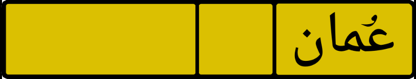
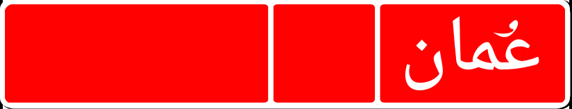
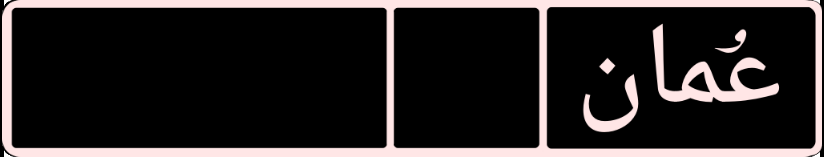

# 🇴🇲 Oman License Plate Mod for BeamNG.drive  
Created by **Sultan** aka **Scoroo** (`scoroo#5113` on Discord)  
Bringing authentic Arabic license plates to BeamNG with modular design and cultural pride.

---

## 🪪 Plate Types

| Plate Name               | Background Color | Format Example | Input Type         | Usage Context         |
|--------------------------|------------------|----------------|--------------------|------------------------|
| **[Oman] Yellow Single** | Yellow            | `X12345`       | Single-letter      | Civilian vehicles      |
| **[Oman] Yellow Double** | Yellow            | `XX12345`      | Double-letter      | Civilian vehicles      |
| **[Oman] Red Single**    | Red               | `R12345`       | Single-letter      | Commercial vehicles    |
| **[Oman] Red Double**    | Red               | `RR12345`      | Double-letter      | Commercial vehicles    |
| **[Oman] Black Single**  | Black             | `B12345`       | Single-letter      | Race/track vehicles    |
| **[Oman] Black Double**  | Black             | `BB12345`      | Double-letter      | Race/track vehicles    |

Each plate features:
- Arabic digits rendered in **Bold Naskh** font  
- Bilingual layout with English letters and the word **"عُمان"**  
- Modular JSON logic for easy updates and customization  
- Format enforcement based on plate type (Single vs Double)

---

## 📷 Preview Gallery

| Private Plate | Commercial Plate | Race Plate |
|---------------|------------------|------------|
|  |  |  |

---

## 📦 Installation

1. Download the `.zip` file from the [Releases]([https://github.com/your-repo/releases](https://github.com/scoroo/-oman-license-plate-mod/releases/download/V2.0/licenseplates_oman.zip) section  
2. Open the folder and take the file `licenseplates_oman.zip`  
3. Place it in your `BeamNG.drive/mods` folder  
4. Launch the game and activate the mod in the Mod Manager  
5. Select your plate type via **Vehicle Config > License Plate Design**

---

## 🎮 In-Game Instructions

Once you've installed the mod, follow these steps to apply the Oman license plates to your vehicle:

1. **Launch BeamNG.drive**  
2. **Spawn any vehicle** from the vehicle selector  
3. Press `Ctrl + W` to open the **Vehicle Configuration Menu**  
4. Navigate to:  
   `Body > License Plate Design` *(or similar, depending on vehicle)*  
5. From the dropdown, select one of the following:  
   - `[Oman] Yellow Single`  
   - `[Oman] Yellow Double`  
   - `[Oman] Red Single`  
   - `[Oman] Red Double`  
   - `[Oman] Black Single`  
   - `[Oman] Black Double`  
6. **Customize your plate** using the typing field at the bottom of the page:  
   - For Single: enter a format like `X12345`  
   - For Double: enter a format like `XX12345`  
   - Click ✔️ the **Apply** button to update the plate in real time

---

## 🧩 Modular JSON Logic

Each plate type is defined in a separate JSON block for easy customization:
- `plateType`: Defines background, font, and layout  
- `regionCode`: Supports bilingual formatting (e.g. "MU" for Muscat)  
- `fontStyle`: Uses Bold Naskh for Arabic digits  

To modify or add new plate types, edit the `licenseplates_oman.json` file inside the mod folder.

---

## 🛠️ Troubleshooting

If plates don’t appear:
- Make sure the mod is enabled in **Mod Manager**  
- Restart BeamNG.drive after installation  
- Check for mod conflicts with other license plate mods

---

## 🧠 About the Creator

I’m Sultan, a modder and server architect based in Halban, Oman. I specialize in:
- Arabic localization and UI customization  
- Server setup and optimization for low-ping gaming  
- Creative direction for culturally authentic mods  
- Emoji pixel art and modular design workflows  

This mod is part of a broader mission to bring **Arabic identity** into gaming with pride and precision.

---

## 💬 Connect with Me

- Discord: `scoroo#5113`  
- GitHub: [github.com/scoroo](https://github.com/scoroo)  
- Location: Muscat, Oman  
- Languages: Arabic 🇸🇦 & English 🇬🇧  

